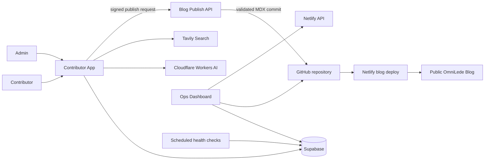

# OmniLede Contributor Ecosystem — Product and Technical Design

**Status:** Approved in chat on 2026-08-27
**Scope:** Extend the existing OmniLede news/PWA repository with a contributor platform, regional delivery, and a separate operations dashboard.
**Primary constraint:** The launch configuration must cost $0, require no payment card, and stop or fall back safely when a free allowance is exhausted.

## 1. Context

OmniLede already publishes manually reviewed MDX articles from `content/articles/{category}` to `https://omnilede-news.netlify.app`. The public site, editorial review desk, GitHub-backed content workflow, installable PWA, legal-page foundation, and Netlify deployment are operational.

This project adds two independently deployed applications while preserving the current blog as the publishing target:

1. a Contributor Platform where registered writers submit original articles, track review status, build reputation, and earn non-cash points;
2. an Ops Dashboard that monitors the blog, contributor application, publishing pipeline, free-tier usage, health checks, and credential-expiry metadata;
3. regional and language-aware delivery on the existing blog.

The original request named Next.js 14. The approved implementation standard is the repository's current, security-reviewed Next.js 16.3.3, React 19, strict TypeScript, and Tailwind CSS 3. All workspace packages use pinned versions and the committed lockfile.

## 2. Product Principles

1. **Spend nothing before revenue.** Paid plans, payment cards, metered overages, real-money payout automation, and chargeable AI providers are disabled.
2. **Fail closed.** Moderation uncertainty, provider failure, quota exhaustion, unsupported languages, and duplicate conflicts go to manual review; they never silently pass.
3. **Protect the publication.** Approved content reaches the blog only through a validated, authenticated, idempotent publishing contract.
4. **Keep rewards honest.** Launch points are reputation/reward units, not money, stored value, cryptocurrency, wages, or a promise of immediate cash redemption.
5. **Separate responsibilities.** Blog Ops and Contributor Ops are visually and technically separated even though they share an admin application.
6. **Minimise personal data.** Do not retain raw visitor IP addresses. Do not expose secrets, moderation inputs, private submissions, wallet records, or contributor personal data.
7. **Never fabricate metrics.** Usage figures and audience data are labelled live, estimated, unavailable, or placeholder according to their actual source.
8. **Human accountability remains available.** Every rejection, approval, publication, suspension, settings change, and future redemption decision has an actor, reason, and timestamp.

## 3. Goals

- Provide email/password contributor accounts with profile, country, preferred language, and future payout-method placeholders.
- Provide a minimal accessible rich-text submission flow with image, title, content, category, region, language, and required guideline acceptance.
- Run deterministic quality checks, text/image safety review, originality search, and recent-topic similarity checks.
- Auto-reject only high-confidence violations, auto-progress only clean eligible submissions, and route every borderline result to people.
- Publish approved submissions as MDX in the existing blog repository and trigger its normal Netlify deployment.
- Track contributor approval, quality, and engagement metrics and assign configurable reputation tiers.
- Maintain an append-only points wallet and a disabled-by-default redemption workflow.
- Offer expiring claims on trending topics sourced from the existing RSS queue or entered by an admin.
- Add regional/language-aware article discovery to the main blog without compromising global SEO or access.
- Provide a protected operations application for deploys, workflows, uptime, pipeline health, quota warnings, and key-expiry reminders.
- Add complete editable legal, contact, advertiser, and disclaimer pages to the blog and contributor application.
- Make all three applications visible and testable with development-only sample records.

## 4. Non-goals and Launch Boundaries

- Do not pay contributors or enable cash/gift-card redemption until the operator has revenue, a funded reserve, reviewed legal/tax terms, and intentionally enables the feature.
- Do not represent indicative local-currency values as guaranteed exchange rates or guaranteed payout values.
- Do not auto-rotate, display, retrieve, or store provider secret values in the Ops database.
- Do not use a serverless runtime filesystem as durable publication storage.
- Do not copy source prose or claim that automated originality checks prove legal originality.
- Do not auto-translate contributor articles. Language filtering uses the language assigned to the article.
- Do not invent GA4 traffic, advertiser reach, Netlify billing, GitHub billing, or provider quota figures.
- Do not alter or reuse an existing Supabase project until the operator confirms the target.
- Do not assume a hosting account or deployment target. The operator confirms the Netlify team and project at deployment time.

## 5. System Architecture

The existing blog remains at the repository root to reduce production risk. The repository becomes an npm workspace without moving current blog routes or content.

```text
/
├── app/                         existing OmniLede blog
├── content/                     existing published articles, drafts, queue
├── apps/
│   ├── contributor/             contributor and contributor-admin application
│   └── ops/                     protected operations application
├── packages/
│   ├── contracts/               schemas and cross-application types
│   ├── ui/                      shared visual primitives and tokens
│   ├── config/                  validated environment contracts
│   └── testing/                 shared test fixtures and helpers
└── supabase/
    ├── migrations/              reviewed database migrations
    └── seed.sql                 development-only example data
```

Each application has an independent Netlify project and environment:

| Application | Recommended project | Responsibility |
| --- | --- | --- |
| Blog | `omnilede-news` | Public reading, regional feed, MDX rendering, publishing receiver |
| Contributor | `omnilede-contributors` | Accounts, submissions, review, points, claims, contributor admin |
| Ops | `omnilede-ops` | Infrastructure, pipeline, usage, health, warnings, credential metadata |

Supabase is the system of record for contributor identities, submissions, review evidence, reputation, points, notifications, claims, pipeline events, contact enquiries, and Ops metadata. Git is the system of record for public MDX articles.



## 6. Zero-cost Provider Policy

### Required launch services

| Service | Purpose | Launch guardrail |
| --- | --- | --- |
| Netlify Free | Three independent Next.js deployments | No paid upgrade or automatic recharge; warn and pause at allowance |
| GitHub public repository | Source, MDX publication, Actions, encrypted backup artifacts | Public standard runners only; minimal token permissions |
| Supabase Free | Auth, Postgres, Storage | Monitor database/storage/egress; restore a paused project manually if inactive |
| Cloudflare Workers Free/Workers AI Free | text safety, image screening, multilingual embeddings, Turnstile | Never enable Workers Paid; provider failure becomes manual review |
| Tavily Researcher Free | originality search | Set a monthly cap; quota exhaustion becomes manual review |
| Brevo Free | auth and transactional email | Transactional email only; daily exhaustion leaves in-app notification and retryable email state |

Hugging Face, Brave Search, paid moderation services, paid email, Tremendous, automatic bank transfer, and chargeable LLM article generation are not launch dependencies.

### Quota behaviour

Every external provider call records provider, operation, status, latency, timestamp, retryability, and a sanitised error code. It does not store secret values. A provider adapter exposes `available`, `degraded`, `exhausted`, or `disabled` health.

When an allowance is exhausted:

- the app does not retry in a tight loop;
- it records a visible pipeline warning;
- affected submissions move to manual review with a provider-unavailable reason;
- no provider is upgraded and no payment method is requested automatically;
- the Ops dashboard explains the reset boundary and manual options.

## 7. Identity, Roles, and Sessions

Supabase Auth provides email/password signup, email confirmation, password reset, and SSR sessions. Phone fields are schema-ready but phone OTP is disabled.

Roles:

- `contributor`: owns a profile and can create/read/update eligible personal content;
- `reviewer`: may inspect review evidence and approve/reject submissions;
- `admin`: includes reviewer privileges plus contributor, rewards, settings, and Ops administration;
- service integrations: server-only principals that perform narrowly scoped pipeline operations.

Authorization data is never read from user-editable metadata. Sensitive admin mutations validate the active user server-side on every request. Admin access to Ops requires MFA. Sessions use secure, HTTP-only, same-site cookies and short-lived access tokens with refresh rotation.

Public endpoints use schema validation, request-size limits, origin/CSRF checks, Turnstile where abuse is likely, and database-backed rate limits. Rich text is stored as a constrained editor document, sanitised on input, and converted through an allowlist for publication.

## 8. Data Model

### Contributor and content

- `profiles`: identity extension, display name, country, preferred language, payout placeholder, account status.
- `roles`: server-managed role assignments.
- `submissions`: author, title, editor document, category, region, language, image reference, workflow status, version.
- `submission_revisions`: immutable content snapshots for conflict recovery and audit.
- `review_runs`: deterministic and provider check results, scores, reasons, model/provider version.
- `duplicate_matches`: compared submission/article, similarity, comparison window, resolution.
- `review_decisions`: decision, actor type, actor ID when human, reason, timestamp.
- `publications`: article slug, blog URL, Git commit, publication state, retry metadata.
- `notifications`: contributor-facing status and reward notices.

### Reputation, rewards, and topics

- `reputation_snapshots`: approval rate, average quality, engagement, tier inputs and effective tier.
- `reputation_rules`: first-article strictness, tier thresholds and review policy.
- `reward_rules`: category and word-band point rates with effective dates.
- `wallet_accounts`: cached balance constrained to match the ledger.
- `wallet_transactions`: immutable, idempotent earn/adjust/redeem ledger entries.
- `redemption_requests`: disabled-by-default request workflow and future manual status.
- `display_rates`: manually configured indicative points-to-local-currency display rates.
- `trending_topics`: RSS/manual topic, category, region, language, source, active window.
- `topic_claims`: contributor, claim time, expiry, submission link and release reason.

### Operations and governance

- `pipeline_events`: stage, outcome, provider, duration and sanitised error.
- `health_checks`: target, status, response time, last checked and consecutive failures.
- `daily_metrics`: published, submitted, auto-approved, manually decided and rejected counts.
- `credential_metadata`: label, provider, environment, added date, optional expiry, owner note and last verification; never the secret.
- `contact_inquiries`: source site, enquiry type, sender fields, message, delivery state and moderation state.
- `audit_log`: append-only security and administrative actions.

All exposed tables receive explicit grants and Row Level Security. Contributors can access only owned rows. They cannot set status, moderation scores, reputation, points, reward rules, roles, or publication state. Server-only tables are placed in a private schema or denied to public roles.

## 9. Image Storage

`submission-images` is a private bucket. Contributors upload only into their own folder using restricted content types, file size, dimensions, and object names. Authors and reviewers receive short-lived signed access.

On approval, the pipeline verifies the original object, strips metadata, creates a web-safe derivative, and copies that derivative into `published-images`. Public blog MDX references only the approved derivative. Rejecting or withdrawing a submission does not make its private image public.

## 10. Contributor Experience

### Public and account routes

| Route | Responsibility |
| --- | --- |
| `/` | Value proposition, workflow, categories, safety and points-beta explanation |
| `/signup`, `/login`, `/forgot-password` | Authentication flows |
| `/onboarding` | Name, country, preferred language, future payout placeholder |
| `/guidelines` | Content and image requirements, review and points terms |

### Authenticated contributor routes

| Route | Responsibility |
| --- | --- |
| `/dashboard` | Status overview, reputation, points and claimed topics |
| `/submit` | Minimal article editor and required guideline agreement |
| `/articles` | Personal submissions by status |
| `/articles/[id]` | Version, review timeline, flags and decision reason |
| `/topics` | Active trending ideas and claim expiry |
| `/wallet` | Points balance, indicative value and immutable history |
| `/redemptions` | Points-only beta explanation; future requests when enabled |
| `/settings` | Profile, language and account security |

The submission form contains image, heading, basic rich text, category, detected/editable region, language, guidelines link, and required acceptance checkbox. It autosaves a local draft, warns before destructive navigation, and uses optimistic version checks to prevent overwriting a changed submission.

### Contributor admin routes

- `/admin/review`: priority queue with article, image, provider evidence, duplicate candidates and decision controls.
- `/admin/contributors`: status, tier, approval history, suspend/restore/ban with reason.
- `/admin/redemptions`: disabled launch queue; future approve/reject/mark-paid actions.
- `/admin/topics`: RSS candidates, manual topics, claims and expiries.
- `/admin/settings`: rewards, display rates, redemption switch, tier rules and provider thresholds.
- `/admin/audit`: searchable administrative audit log.

## 11. Automated Review Pipeline

Submission immediately creates an immutable revision and receives `under_review` status. The pipeline is retryable and idempotent by submission version.

### Stage 1: deterministic quality gate

- required fields and guideline acceptance;
- allowed category, language and region values;
- normalised title with no all-caps abuse;
- minimum word count and configured word bands;
- link count, domain diversity and spam pattern limits;
- image MIME signature, size and dimensions;
- exact content and perceptual image duplicate hashes.

### Stage 2: safety checks

- Cloudflare Llama Guard classifies text hazard categories;
- a free Cloudflare vision-capable model classifies sexual, violent and graphic image risk;
- high-confidence configured violations auto-reject;
- uncertain scores, unsupported languages and provider errors go to manual review.

Automated safety classification is evidence, not a legal or editorial guarantee. The provider version, threshold version, and sanitised response are retained for reproducibility.

### Stage 3: originality checks

The pipeline selects a small number of distinctive sentences and title phrases and queries Tavily Basic Search. It compares returned snippets and URLs using normalised n-grams and source-domain evidence. Likely copying is flagged for manual review; it is not automatically rejected unless the deterministic evidence is an exact prohibited duplicate.

### Stage 4: duplicate-topic checks

Cloudflare multilingual embeddings represent the title plus a bounded summary. Supabase stores the vector and compares it against submissions and published articles from the previous 48 hours in the same broad category.

If a conflict group contains multiple clean pending submissions, the pipeline ranks originality, sourced factual density, structure, and word-count-band fit. Only a clear leader with a configured margin may continue automatically. Other candidates go to manual review. If an article on the topic is already published, the new submission goes to review for a distinct-angle decision.

### Decision state machine

```text
draft
  -> under_review
     -> rejected                 high-confidence violation
     -> manual_review            uncertainty, conflict, outage, new-author rule
     -> approved                 clean and eligible
manual_review
  -> rejected | approved | changes_requested
approved
  -> publishing -> published | publishing_failed
```

New contributors' first configurable number of articles always enter manual review even when automated checks are clean. Reputation can reduce manual routing but never bypass high-confidence safety, originality, or publication validation.

## 12. Publishing Contract

Approved content is never persisted by writing to Netlify's runtime filesystem.

1. Contributor admin creates an idempotent `publication` outbox row.
2. The Contributor server signs a canonical JSON payload with an HMAC integration secret and sends it to the Blog publish API.
3. The Blog API validates timestamp, nonce, signature, schema, category, slug, attribution, source URL, image URL, body allowlist, and replay state.
4. The Blog server renders canonical frontmatter and MDX.
5. A repository-scoped GitHub credential creates a commit adding `content/articles/{category}/{slug}.mdx`.
6. The normal GitHub-linked Netlify deployment starts. An optional build hook is used only if the Git integration is unavailable, avoiding duplicate deploys.
7. The publication row records commit and URL. A unique constraint prevents duplicate article or wallet credit.
8. The contributor receives points once the Git commit succeeds. Infrastructure deployment failure does not punish an approved contributor; Ops reports and retries the deployment path.

The blog publish credential is server-only and limited to the selected repository's contents. The Ops GitHub credential remains read-only and is not reused for publishing.

## 13. Reputation and Rewards

Quality scores combine deterministic completeness, originality evidence, structure, sourcing, and reviewer outcomes. Engagement can include privacy-respecting article views and reading completion only after analytics is connected; absent analytics is `unavailable`, not zero.

Example tiers:

- `New`: strict manual review for the first configured approvals;
- `Trusted`: normal automatic eligibility with all safety gates;
- `Verified`: proven approval and quality history, prioritised processing, never exemption from safety.

Reward points are calculated from the effective reward rule at approval time and preserved on the ledger. An article cannot earn twice. Admin adjustments require a reason and produce a compensating transaction rather than editing history.

`REDEMPTIONS_ENABLED=false` is a database and server-side launch invariant. The interface explains that points have no guaranteed cash value during beta. Before enabling redemption, the operator must fund the programme, define supported regions and methods, obtain legal/tax advice, publish final terms, and configure a manual or rewards-provider settlement path.

## 14. Trending Topic Board

The existing RSS discovery queue can import eligible story ideas without importing or republishing source prose. Admins can add, edit, pause, expire, and prioritise topics.

A contributor may hold a configurable number of active claims. A claim defaults to 24 hours, shows a countdown, and releases automatically if no submission is linked. Linking a submission consumes the claim. Claims do not guarantee approval or points.

## 15. Regional and Language Delivery on the Blog

Netlify Edge geolocation provides an initial ISO country code without a separate geolocation key. The system does not persist the raw IP.

Global content remains the stable server-rendered/SEO base. On the first visit, the browser obtains country context, stores a user-overridable preference, and reorders or supplements the feed with matching region/language stories. It never hides global top stories.

The masthead contains a visible `Showing: Your Region` control with Global, supported region, and language options. A user's explicit selection always overrides detection. Article frontmatter adds optional `region`, `language`, `contributorId`, and contributor attribution fields while remaining compatible with existing articles.

## 16. Ops Dashboard

The protected Ops application starts with four summary cards: articles published this month, submissions this month, pending reviews, and active warnings.

### Blog Ops

- live blog uptime, response time and last check;
- recent Netlify deploys, state, duration and failure link;
- current Netlify account model: legacy build minutes or credit-based usage;
- live usage only when the provider exposes it, otherwise clearly labelled calculated estimate and direct provider link;
- GitHub workflow runs, status, duration and logs link;
- public-repository Actions shown as non-billable rather than assigned a fictional minute balance.

### Contributor App Ops

- contributor app uptime and recent deploys;
- submission queue by state and age;
- daily auto/manual/reject/publish counts;
- moderation, search, email and embedding health;
- quota exhaustion, rate-limit events and retryable pipeline errors.

### Credential metadata

The dashboard stores label, provider, environment, added date, optional manually entered expiry, owner note, and verification state. It never asks for or stores the credential value. Provider secrets remain in Netlify, GitHub, Supabase, Cloudflare, Tavily, or Brevo settings.

Warnings begin 14 days before expiry, turn yellow/red by configured thresholds, and link to provider-specific rotation checklists. Rotation always requires the operator to create and replace the credential manually. A successful connection test can update `last_verified_at` without revealing the credential.

### Health checks

A public-repository GitHub Actions schedule checks the blog and contributor URLs with bounded timeouts and writes a signed health result. Dashboard loads may request a fresh check, but they do not create an unbounded monitoring loop.

## 17. Legal, Contact, and Advertiser Pages

Both the blog and contributor application receive:

- Privacy Policy;
- Terms of Service;
- Contributor Content Guidelines and Points/Redemption Terms;
- Advertiser and Partner Information;
- Contact;
- Disclaimer.

Business-specific facts use explicit markers such as `[FILL IN: LEGAL OPERATOR NAME]`, `[FILL IN: REGISTERED ADDRESS]`, `[FILL IN: TAX/GST DETAILS]`, `[FILL IN: PRIVACY EMAIL]`, and `[FILL IN: FINAL PAYOUT PROCESSOR]`.

The contributor licence retains author credit while granting the operator a non-exclusive publishing, display, formatting, distribution, promotion, and archival licence, subject to the final operator-reviewed terms. Finance and Share Market pages state that contributor views are not verified professional financial advice.

Contact and partner forms distinguish general/support from advertising/partnership enquiries. They validate and rate-limit input, store the enquiry first, then send a transactional notification. Failed email remains visible for admin follow-up. Advertiser metrics remain placeholders until genuine GA4 data is connected.

These templates are operational starting points, not a substitute for legal advice in the operator's or contributors' jurisdictions.

## 18. Visual Direction and Accessibility

The ecosystem uses a distinct OmniLede editorial system inspired by professional media hierarchy without copying Billboard branding, protected assets, or exact trade dress.

- palette: ink black, paper white, neutral dividers, restrained electric blue and signal red;
- typography: editorial display face plus legible interface/body sans serif;
- layouts: strong mastheads, clear story hierarchy, compact metadata, spacious reading width;
- dashboards: tables and status rails where density matters, not decorative card grids everywhere;
- motion: minimal, functional, and disabled for reduced-motion preferences;
- accessibility: semantic landmarks, WCAG AA contrast, keyboard flows, visible focus, labelled errors, touch targets, and screen-reader status announcements.

The existing blog remains installable. The Contributor Platform also ships PWA metadata and offline-safe shell/status guidance; submissions themselves require connectivity. Ops remains a protected web application rather than an offline PWA.

## 19. Configuration and Secret Boundaries

Environment schemas fail the build for missing production-critical values and never expose server secrets through public prefixes.

Representative server-side configuration:

- Supabase project URL, publishable key, server secret/service role;
- Cloudflare account ID and restricted AI token;
- Tavily API key;
- Brevo SMTP/API credentials;
- blog publish HMAC secret;
- GitHub repository, branch and contents-write publishing token;
- Netlify site IDs, read-only Ops token and optional build hook;
- admin bootstrap identity and allowed origins;
- feature flags including `REDEMPTIONS_ENABLED=false`.

The repository contains `.env.example` files with names, purpose, scope, and free-tier notes but no values. Local secrets remain in ignored files. GitHub Actions, Netlify, Supabase and provider secrets are entered through their secure settings. Any credential previously exposed in chat or source must be revoked rather than reused.

## 20. Backups and Recovery

Schema migrations and reproducible seed fixtures live in Git. Development sample records cover under-review, published, rejected, duplicate-conflict, provider-exhausted, wallet and Ops warning states.

Production sample data is never inserted automatically. A scheduled public-repository Action makes a logical Supabase export, encrypts it before upload, and retains only bounded ciphertext artifacts. The decryption key is not stored in the repository or artifact. Restoration is documented and tested against a disposable local or branch database before production use.

Failed publication uses the outbox record for retry. Duplicate Git commits, wallet credits, review decisions, topic claims and contact notifications are prevented by unique idempotency keys.

## 21. Testing and Verification

### Automated local checks

- content validation;
- unit tests for scoring, rules, reward calculation, signatures and state machines;
- integration tests for RLS expectations, storage policies, publishing idempotency and quota fallback;
- component tests for forms, dashboards, review decisions and accessibility;
- Playwright flows for contributor signup, submission, manual review, publication, rejection, topic claim, wallet and Ops views;
- lint, strict typecheck and three production builds.

### Live verification

- verify every public/legal/contact route on each deployed application;
- test contributor login, password reset and email confirmation;
- submit safe, rejected and borderline fixtures;
- approve a test article and confirm the Git commit, Netlify deployment and final blog route;
- verify a contributor cannot read or modify another contributor's data;
- verify admin MFA and protected Ops routes;
- confirm no server secret appears in client bundles, HTML, logs or public environment;
- validate PWA manifests and offline behaviour;
- check mobile, tablet and desktop layouts and browser console errors;
- test provider-exhausted mode without making paid calls.

Nothing is reported complete until the relevant build, tests and live smoke checks pass.

## 22. Delivery Phases

1. Reconcile remote content commits and preserve unrelated local changes.
2. Establish the workspace and shared contracts without moving the production blog.
3. Confirm/provision Supabase, apply RLS/storage migrations, generate types and load development fixtures.
4. Build the Contributor Platform vertical slice and admin review experience.
5. Connect zero-cost moderation, originality and duplicate providers with fail-closed behaviour.
6. Implement the signed Blog publish receiver, GitHub MDX commit and publication reconciliation.
7. Add blog regional/language delivery, contributor attribution and legal/contact pages.
8. Build Ops, health checks, provider telemetry and credential metadata.
9. Run security, accessibility, unit, integration, E2E and production-build verification.
10. Confirm the Netlify account/project targets, create separate projects, enter secrets, deploy and run live tests.

Each major handoff is labelled **Automatic**, **Manual**, **Verified**, or **Not done**. Account creation, login, CAPTCHA, payment, identity, banking, API-key creation and secret transmission are never implied complete.

## 23. Integration Use

- GitHub operations use the authenticated local GitHub integration/CLI to branch, commit, push and configure Actions; the operator does not need to run git commands.
- Supabase operations use the connected Supabase integration to inspect the selected project, execute reviewed SQL, verify advisors, generate types and inspect logs.
- Netlify has no native connected plugin in this environment. Its authenticated in-app browser session is used for project creation, environment configuration and deployment, with action-time confirmation before transmitting secrets.
- Vercel automation is available but is not the selected commercial deployment path.
- The in-app browser and installed Vitest, Testing Library and Playwright tools perform real local and live verification.
- Cloudflare, Tavily and Brevo have no connected integrations. The operator logs into or creates those free accounts; browser assistance completes non-sensitive setup and requests confirmation before key creation or secret entry.

## 24. Risks and Mitigations

- **Free-tier changes or exhaustion:** central adapters, visible quotas, no paid fallback, manual-review degradation.
- **Moderation false positives/negatives:** conservative thresholds, evidence retention, human review and appeals/reason visibility.
- **Plagiarism uncertainty:** search is a flag, not proof; preserve sources and require editorial judgement.
- **Duplicate race conditions:** transactional conflict groups, version locks and idempotency keys.
- **Cross-service partial failure:** publication outbox, retry state, immutable decisions and independent wallet credit.
- **Contributor reward liability:** points-only launch, server-enforced redemption flag and clear terms.
- **Secret leakage:** provider stores only, minimal scopes, no plaintext Ops storage, expiry reminders and rotation checklists.
- **Supabase free-project pause/backups:** activity monitoring, encrypted logical exports and tested recovery.
- **Netlify billing-model differences:** detect legacy minutes versus current credits and label estimates honestly.
- **Legal/regional complexity:** editable placeholders, contributor licence, financial disclaimer, final professional review before monetised payouts.

## 25. Acceptance Criteria

- The existing blog continues to build, deploy and publish its current MDX library.
- Contributor and Ops applications build independently from the same repository and deploy as separate projects.
- A contributor can register, submit, track a decision, see reputation, claim a topic and view an accurate points ledger.
- Clean, violating, duplicate, uncertain and provider-unavailable submissions follow the documented states.
- An approved submission produces exactly one validated MDX article and exactly one reward transaction.
- Cross-user access tests and Supabase advisors report no unresolved critical authorization issue.
- Regional delivery keeps global content visible and honours explicit user overrides.
- Ops shows distinct Blog and Contributor views, real/labelled infrastructure data, pipeline health and expiry warnings without storing secrets.
- Legal/contact/advertiser pages exist on both public products with all business-specific gaps marked `[FILL IN: ...]`.
- Redemptions and paid providers remain disabled.
- Local tests, E2E tests, lint, typecheck, production builds and live browser smoke checks pass before completion is claimed.

## 26. Account and Approval Gates

Before external provisioning or deployment, the operator must confirm:

1. which existing or new Supabase project is dedicated to OmniLede;
2. Netlify team `rickysharan999` and the exact two new project names;
3. GitHub repository `Rickysharan/blog` and production branch;
4. creation/login for Cloudflare Free, Tavily Free and Brevo Free;
5. action-time permission before any secret is generated, transmitted or stored in a provider dashboard.

GA4, AdSense, a custom domain, a rewards provider, tax/bank configuration, and real-money redemption remain post-revenue work.
